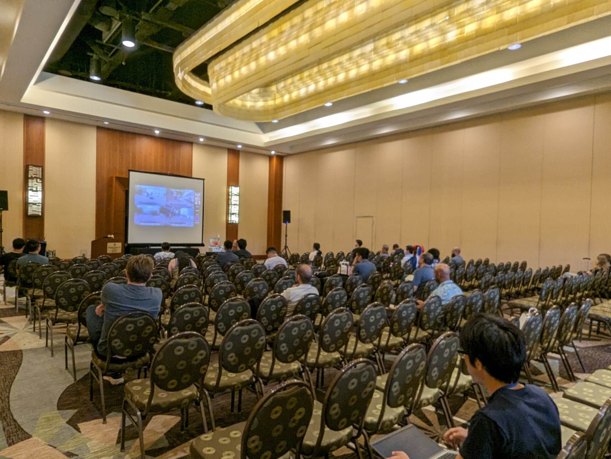

# A Survey on Multimodal Large Language Models for Autonomous Driving

### We add new references from CVPR 2024 in our repo, refer from [自动驾驶之心](https://github.com/autodriving-heart/CVPR-2024-Papers-Autonomous-Driving).

### :boom: News: MAPLM (Tencent, UIUC) and LaMPilot (Purdue University) from our team are accepted by CVPR 2024.
### News: [LLVM-AD Workshop](https://llvm-ad.github.io/schedule/) is successfully organized at WACV 2024.



[WACV 2024 Proceedings](https://openaccess.thecvf.com/WACV2024_workshops/LLVM-AD)  |  [Arxiv](https://arxiv.org/abs/2311.12320)   |   [Workshop](https://llvm-ad.github.io/)    |  [Report by 机器之心](https://www.jiqizhixin.com/articles/2023-12-18-4)

### Summary of the 1st WACV Workshop on Large Language and Vision Models for Autonomous Driving (LLVM-AD)

## Abstract

With the emergence of Large Language Models (LLMs) and Vision Foundation Models (VFMs), multimodal AI systems benefiting
from large models have the potential to equally perceive the real world, make decisions, and control tools as humans. In
recent months, LLMs have shown widespread attention in autonomous driving and map systems. Despite its immense
potential, there is still a lack of a comprehensive understanding of key challenges, opportunities, and future endeavors
to apply in LLM driving systems. In this repo, we present a systematic investigation in this field. We first introduce
the background of Multimodal Large Language Models (MLLMs), the multimodal models development using LLMs, and the
history of autonomous driving. Then, we overview existing MLLM tools for driving, transportation, and map systems
together with existing datasets and benchmarks. Moreover, we summarized the works in The 1st WACV Workshop on Large
Language and Vision Models for Autonomous Driving (LLVM-AD), which is the first workshop of its kind regarding LLMs in
autonomous driving. To further promote the development of this field, we also discuss several important problems
regarding using MLLMs in autonomous driving systems that need to be solved by both academia and industry.

## Awesome Papers

### MLLM for Perception & Planning & Control for Autonomous Driving
Please ping us if you find any interesting new papers in this area. We will update them into the Table. And all of them will be included in the next version of the survey paper.    

| Model                                                                       | Year | Backbone                | Task                              | Modality                 | Learning            | Input                | Output             |
|-----------------------------------------------------------------------------|------|-------------------------|-----------------------------------|--------------------------|---------------------|----------------------|--------------------|
| [Driving with LLMs](https://arxiv.org/abs/2310.01957)                      | 2023 | LLaMA                   | Perception Control                | Vision, Language          | Finetuning            | Vector Query         | Response / Actions |
| [Talk2BEV](https://arxiv.org/abs/2310.02251)                               | 2023 | Flan5XXL Vicuna-13b     | Perception Planning               | Vision, Language          | In-context learning | Image Query          | Response           |
| [GAIA-1](https://arxiv.org/abs/2309.17080)                                 | 2023 | -                       | Planning                          | Vision, Language          | Pretraining            | Video Prompt         | Video              |
| [Dilu](https://arxiv.org/abs/2309.16292)                                   | 2023 | GPT-3.5 GPT-4           | Planning Control                  | Language                 | In-context learning | Text                 | Action             |
| [Drive as You Speak](https://arxiv.org/abs/2309.10228)                     | 2023 | GPT-4                   | Planning                          | Language                 | In-context learning | Text                 | Code               |
| [Receive, Reason, and React](https://arxiv.org/abs/2310.08034)             | 2023 | GPT-4                   | Planning Control                  | Language                 | In-context learning | Text                 | Action             |
| [Drive Like a Human](https://arxiv.org/abs/2307.07162)                     | 2023 | GPT-3.5                 | Planning Control                  | Language                 | In-context learning | Text                 | Action             |
| [GPT-Driver](https://arxiv.org/abs/2310.01415)                             | 2023 | GPT-3.5                 | Planning                          | Vision, Language          | In-context learning | Text                 | Trajectory         |
| [SurrealDriver](https://arxiv.org/abs/2309.13193)                          | 2023 | GPT-4                   | Planning Control                  | Language                 | In-context learning | Text                 | Text / Action      |
| [LanguageMPC](https://arxiv.org/abs/2310.03026)                            | 2023 | GPT-3.5                 | Planning                          | Language                 | In-context learning | Text                 | Action             |
| [DriveGPT4](https://arxiv.org/abs/2310.01412)                              | 2023 | Llama 2                 | Planning Control                  | Vision, Language          | In-context learning | Image Text Action    | Text / Action      |
| [Domain Knowledge Distillation from LLMs](https://arxiv.org/abs/2310.01412) | 2023 | GPT-3.5                 | Text Generation                   | Language                 | In-context learning | Text                 | Concept            |
| [LaMPilot](https://arxiv.org/abs/2312.04372)                               | 2023 | GPT-4 / LLaMA-2 / PaLM2 | Planning (Code Generation)        | Language                 | In-context learning | Text                 | Code as action     |
| [Language Agent](https://arxiv.org/abs/2311.10813)                         | 2023 | GPT-3.5                 | Planning                          | Language                 | Training            | Text                 | Action             | 
| [LMDrive](https://arxiv.org/abs/2312.07488)                                | 2023 | CARLA + LLaVA           | Planning Control                  | Vision, Language          | Training            | RGB Image LiDAR Text | Control Signal     |
| [On the Road with GPT-4V(ision)](https://arxiv.org/abs/2311.05332)         | 2023 | GPT-4Vision             | Perception                        | Vision, Language          | In-context learning | RGB Image Text       | Text Description   |
| [DriveLLM](https://ieeexplore.ieee.org/abstract/document/10297415)         | 2023 | GPT-4                   | Planning Control                  | Language                 | In-context learning | Text                 | Action             |
| [DriveMLM](https://arxiv.org/abs/2312.09245)                              | 2023 | LLaMA+Q-Former          | Perception Planning               | Vision, Language          | Training            | RGB Image LiDAR Text | Decision State     |
| [DriveLM](https://arxiv.org/abs/2312.14150)                             | 2023 | GVQA                    | Perception Planning               | Vision, Language          | Training            | RGB Image Text       | Text / Action      |   
| [LangProp](https://arxiv.org/abs/2401.10314)                            | 2024 | IL, DAgger, RL + ChatGPT  | Planning (Code/Action Generation) | CARLA simulator Vsion, Language | Training            | CARLA simulator Text | Code as action     |
| [LimSim++](https://arxiv.org/abs/2402.01246)                            | 2024 | LimSim, GPT-4  |  Planning  |  Simulator BEV, Language  |  In-context learning   |   Simulator Vision, Language   |   Text / Action     |
| [DriveVLM](https://arxiv.org/abs/2402.12289)                           | 2024 | Qwen-VL  |  Planning  | Sequence of Images, Language |   Training   |   Vision, Language   |   Text / Action     |
| [RAG-Driver](https://arxiv.org/abs/2402.10828)                         | 2024 | Vicuna1.5-7B  |   Planning Control   |   Video, Language   |   Training   |   Vision, Language   |   Text / Action     |
| [ChatSim](https://arxiv.org/abs/2402.05746)                            | 2024 | GPT-4  |   Perception (Image Editing)   |   Image, Language   |   In-context learning   |   Vision, Language   |   Image     |
| [VLP](https://arxiv.org/abs/2401.05577)                            | 2024 | GPT-4  |   Planning   |   Image, Language   |   Training  |   Vision, Language   |   Text / Action     |

### Datasets

The table is inspired by Comparison and stats in DriveLM

|                                Dataset                                 |                       Base Dataset                       |     Language Form      |                  Perspectives                  |                                Scale                                |                         Release?                          |
|:----------------------------------------------------------------------:|:--------------------------------------------------------:|:----------------------:|:----------------------------------------------:|:-------------------------------------------------------------------:|:---------------------------------------------------------:|
| [BDD-X 2018](https://github.com/JinkyuKimUCB/explainable-deep-driving) |          [BDD](https://bdd-data.berkeley.edu/)           |      Description       |      Planning Description & Justification      |                     8M frames, 20k text strings                     |                  **:heavy_check_mark:**                   |
|          [HAD HRI Advice 2019](https://usa.honda-ri.com/had)           |           [HDD](https://usa.honda-ri.com/hdd)            |         Advice         |     Goal-oriented & stimulus-driven advice     |                 5,675 video clips, 45k text strings                 |                  **:heavy_check_mark:**                   |
|         [Talk2Car 2019](https://github.com/talk2car/Talk2Car)          |          [nuScenes](https://www.nuscenes.org/)           |      Description       |             Goal Point Description             |                    30K frames, 10K text strings                     |                  **:heavy_check_mark:**                   |
|    [SUTD-TrafficQA 2021](https://github.com/sutdcv/SUTD-TrafficQA)     |                     Self-Collected                       |           QA           |                       QA                       |                     10k frames 62k text strings                     |                  **:heavy_check_mark:**                   |
|              [DRAMA 2022](https://usa.honda-ri.com/drama)              |                     Self-Collected                       |      Description       |                 QA + Captions                  |                    18k frames, 100k text strings                      |                  **:heavy_check_mark:**                   |
|          [nuScenes-QA 2023](https://arxiv.org/abs/2305.14836)          |          [nuScenes](https://www.nuscenes.org/)           |           QA           |               Perception Result                |                 30K frames, 460K generated QA pairs                 | [nuScenes-QA](https://github.com/qiantianwen/NuScenes-QA) |
|         [Reason2Drive 2023](https://arxiv.org/abs/2312.03661)          |                  nuScenes, Waymo, ONCE                   |           QA           |      Perception, Prediction and Reasoning      |                        600K video-text pairs                        | [Reason2Drive](https://github.com/fudan-zvg/reason2drive) |
|           [Rank2Tell 2023](https://arxiv.org/abs/2309.06597)           |                      Self-Collected                      |           QA           |         Risk Localization and Ranking          |                     116 video clips (20s each)                      |      [Rank2Tell](https://usa.honda-ri.com/rank2tell)      | 
|        [DriveLM 2023](https://github.com/OpenDriveLab/DriveLM)         |          [nuScenes](https://www.nuscenes.org/)           | QA + Scene Description | Perception, Prediction and Planning with Logic |                 30K frames, 360k annotated QA pairs                 |    [DriveLM](https://github.com/OpenDriveLab/DriveLM)     |
|             [MAPLM 2023](https://github.com/LLVM-AD/MAPLM)             | [THMA](https://dl.acm.org/doi/10.1609/aaai.v37i13.26848) | QA + Scene Description |  Perception, Prediction and HD Map Annotation  | 2M frames, 16M annotated HD map Description + 13K released QA pairs |         [MAPLM](https://github.com/LLVM-AD/MAPLM)         |
|            [LingoQA 2023](https://arxiv.org/abs/2312.14115)            |                    Collected by Wayve                    |           QA           |            Perception, and Planning            |                 28K frames, 419.9K QA + Captioning                  |       [LingoQA](https://github.com/wayveai/LingoQA)       |

### Other Survey Papers

| Model                                                                                                                                                                  | Year | Focus                                                                                                                                                                  |
|------------------------------------------------------------------------------------------------------------------------------------------------------------------------|------|------------------------------------------------------------------------------------------------------------------------------------------------------------------------|
| [Vision Language Models in Autonomous Driving and Intelligent Transportation Systems](https://arxiv.org/abs/2310.14414)                                                | 2023 | Vision-Language Models for Transportation Systems                                                                                                                      |        
| [LLM4Drive: A Survey of Large Language Models for Autonomous Driving](https://arxiv.org/abs/2311.01043)                                                                | 2023 | Language Models for Autonomous Driving                                                                                                                                 |    
| [Towards Knowledge-driven Autonomous Driving](https://arxiv.org/abs/2312.04316)                                                                                        | 2023 | Summary on how to use large language models, world models, and neural rendering to contribute to a more holistic, adaptive, and intelligent autonomous driving system. | 
| [Applications of Large Scale Foundation Models for Autonomous Driving](https://arxiv.org/abs/2311.12144)                                                               | 2023 | Large Scale Foundation Models (LLMs, VLMs, VFMs, World Models) for Autonomous Driving                                                                                  |
| [Data-Centric Evolution in Autonomous Driving: A Comprehensive Survey of Big Data System, Data Mining, and Closed-Loop Technologies](https://arxiv.org/abs/2401.12888) | 2023 | Closed-Loop Autonomous Driving                                                                                                                                         |
| [A Survey on Autonomous Driving Datasets: Data Statistic, Annotation, and Outlook](https://arxiv.org/abs/2401.01454)                                                   | 2024 | Autonomous Driving Datasets                                                                                                                                            |      
| [A Survey for Foundation Models in Autonomous Driving](https://arxiv.org/abs/2402.01105)                                                   | 2024 | Multimodal Foundation Models for Autonomous Driving                                                                                                                                            |      

### Papers Accepted by WACV 2024 LLVM-AD

[A Survey on Multimodal Large Language Models for Autonomous Driving](https://openaccess.thecvf.com/content/WACV2024W/LLVM-AD/html/Cui_A_Survey_on_Multimodal_Large_Language_Models_for_Autonomous_Driving_WACVW_2024_paper.html)

[Drive as You Speak: Enabling Human-Like Interaction with Large Language Models in Autonomous Vehicles](https://openaccess.thecvf.com/content/WACV2024W/LLVM-AD/html/Cui_Drive_As_You_Speak_Enabling_Human-Like_Interaction_With_Large_Language_WACVW_2024_paper.html)

[Drive Like a Human: Rethinking Autonomous Driving with Large Language Models](https://arxiv.org/abs/2307.07162)

[A Game of Bundle Adjustment - Learning Efficient Convergence](https://arxiv.org/abs/2308.13270) Accepted as a tech
report for their ICCV 2023 Paper

[VLAAD: Vision and Language Assistant for Autonomous Driving](https://openaccess.thecvf.com/content/WACV2024W/LLVM-AD/html/Park_VLAAD_Vision_and_Language_Assistant_for_Autonomous_Driving_WACVW_2024_paper.html)

[A Safer Vision-based Autonomous Planning System for Quadrotor UAVs with Dynamic Obstacle Trajectory Prediction and Its Application with LLMs](https://openaccess.thecvf.com/content/WACV2024W/LLVM-AD/html/Zhong_A_Safer_Vision-Based_Autonomous_Planning_System_for_Quadrotor_UAVs_With_WACVW_2024_paper.html)

[Human-Centric Autonomous Systems With LLMs for User Command Reasoning](https://openaccess.thecvf.com/content/WACV2024W/LLVM-AD/html/Yang_Human-Centric_Autonomous_Systems_With_LLMs_for_User_Command_Reasoning_WACVW_2024_paper.html)

[NuScenes-MQA: Integrated Evaluation of Captions and QA for Autonomous Driving Datasets using Markup Annotations](https://openaccess.thecvf.com/content/WACV2024W/LLVM-AD/html/Inoue_NuScenes-MQA_Integrated_Evaluation_of_Captions_and_QA_for_Autonomous_Driving_WACVW_2024_paper.html)

[Latency Driven Spatially Sparse Optimization for Multi-Branch CNNs for Semantic Segmentation](https://openaccess.thecvf.com/content/WACV2024W/LLVM-AD/html/Zampokas_Latency_Driven_Spatially_Sparse_Optimization_for_Multi-Branch_CNNs_for_Semantic_WACVW_2024_paper.html)

[LIP-Loc: LiDAR Image Pretraining for Cross-Modal Localization](https://openaccess.thecvf.com/content/WACV2024W/LLVM-AD/html/Shubodh_LIP-Loc_LiDAR_Image_Pretraining_for_Cross-Modal_Localization_WACVW_2024_paper.html)

## Future Directions Section

#### Social Behavior for Autonomous Driving (UIUC, Purdue University)

#### Personalized Autonomous Driving (Purdue University, UIUC)

#### Hardware Support for LLMs in Autonomous Driving (SambaNova Systems)

#### LLMs for HD Maps (Tencent)

#### Code as Action for Autonomous Driving (Purdue University, UIUC)

## Citation

If the survey and our workshop inspire you, please cite our work:

```
@inproceedings{cui2024survey,
  title={A survey on multimodal large language models for autonomous driving},
  author={Cui, Can and Ma, Yunsheng and Cao, Xu and Ye, Wenqian and Zhou, Yang and Liang, Kaizhao and Chen, Jintai and Lu, Juanwu and Yang, Zichong and Liao, Kuei-Da and others},
  booktitle={Proceedings of the IEEE/CVF Winter Conference on Applications of Computer Vision},
  pages={958--979},
  year={2024}
}
```


